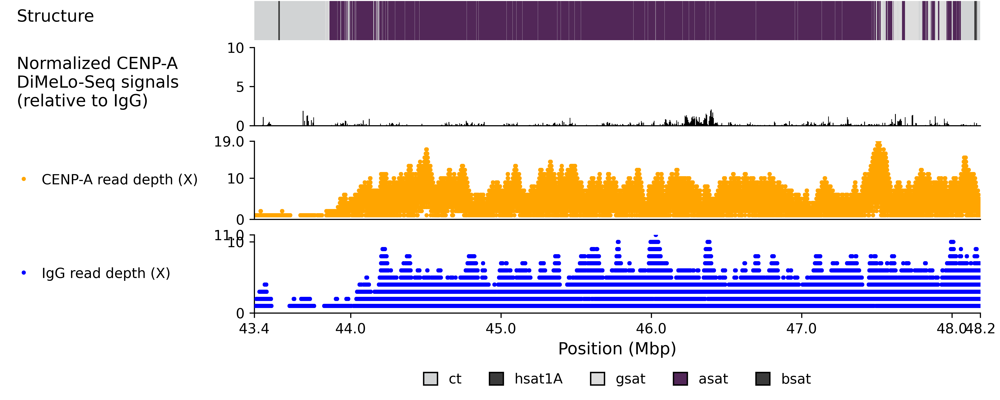

# Snakemake_DiMeLo-seq_Viz
Workflow to visualize DiMeLo-seq data with optional bells and whistles.



> NA20355 H1 chromosome 8

## Getting Started
```bash
git clone https://github.com/logsdon-lab/Snakemake-DiMeLo-seq-Viz.git --recursive
cd Snakemake-DiMeLo-seq-Viz
```

Install Snakemake
```bash
conda env create -f env.yaml --name smk-dimelo-vis
conda activate smk-dimelo-vis
```

## Configuration
Copy and modify the configfile for your samples
```bash
cp config/config_template.yaml config/new_config.yaml
```

Modify the config by adding:
* A sample name
* A path to assembly
* A BED file of region to visualize
* A name + path to reads of the treatment and the control case.

An example of an updated config:
```yaml
samples:
  - name: HG00513
    # Assembly to align to
    asm_fa: data/assembly/HG00513-asm-renamed-reort.fa
    # Bedfile of region.
    bed: "data/bed/HG00513_centromere.bed"
    treatment:
      name: CENPA
      reads:
      # Reads as unaligned BAM file.
      - data/reads/CENPA/20250729_DMLseq_HG00513_ULK114.bam
    control:
      name: "IgG"
      reads:
      - data/reads/IgG/20250729_DMLseq_HG00513_ULK114.bam

  aligner: "minimap2"
  aligner_opts: "-y -a --eqx --cs -x lr:hqae -I8g -s 4000"
  output_dir: "results/align"
  logs_dir: "logs/align"
  benchmarks_dir: "benchmarks/align"
  threads_aln: 24
  mem_aln: 50G
  samtools_view_flag: 2308
```

The output plot can be modified and additional tracks can be added by modifying the base cenplot toml and adding it
```bash
cp config/base_cenplot.toml config/base_cenplot_modified.toml
```

```yaml
samples:
  - name: HG00513
    asm_fa: data/assembly/HG00513-asm-renamed-reort.fa
    bed: "data/bed/HG00513_centromere.bed"
    # Add a satellite annotation track
    tracks:
      sat_annot: test/data/HG00513_sat_annot.bed.gz
    # With this plot format.
    cfg_cenplot: test/config/base_cenplot_modified.toml
```

Where the `cfg_cenplot` track's path matches the track name.
```toml
[[tracks]]
position = "relative"
proportion = 0.025
type = "label"
path = "sat_annot" # <-- Matches tracks.sat_annot

[tracks.options]
legend = true
hide_x = true
legend_title = "Structure"
legend_title_only = true
```

> [!INFO]
> For a full list of parameters, see `/project/logsdon_shared/projects/T21_AG167_trio/Snakemake-DiMeLo-seq-Viz/config/config.schema.yaml`.

## Run
```bash
snakemake -p --configfile config/new_config.yaml --sdm conda -c 20 -n
```

## Test
Run example on NA20355 chr8.
```bash
# Installs conda environments
# Roughly ~3 minutes.
snakemake -p --configfile test/config/config_NA20355.yaml --sdm conda -c 20 -n
```

## Cite
**Gao S, Oshima KK**, Chuang SC, Loftus M, Montanari A, Gordon DS, Human Genome Structural Variation Consortium, Human Pangenome Reference Consortium, Hsieh P, Konkel MK, Ventura M, Logsdon GA. A global view of human centromere variation and evolution. bioRxiv. 2025. p. 2025.12.09.693231. [doi:10.64898/2025.12.09.693231](https://doi.org/10.64898/2025.12.09.693231)
